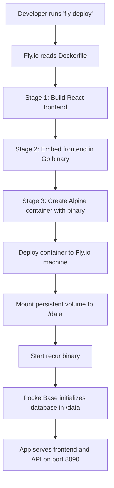

# How Recur Deployment Works - Simple Explanation

*A comprehensive but easy-to-understand guide for any developer working on this project*

## 🏗️ The Big Picture

Recur is a **single-binary application** that combines:
- **Frontend**: React app (TypeScript, Vite)
- **Backend**: Go server with PocketBase framework
- **Database**: SQLite (managed by PocketBase)

Everything gets packaged into **one executable file** that serves both the web interface and API.

---

## 📁 How PocketBase Works in This Project

### What is PocketBase?
PocketBase is a **Go framework** (not just a database) that provides:
- Built-in SQLite database
- Automatic REST API
- Admin dashboard
- User authentication
- File uploads
- Real-time subscriptions

### The Database Folder (`/db`)
When PocketBase runs, it creates a folder to store:
```
db/
├── data.db          # Main SQLite database file
├── logs.db          # System logs database  
├── backups/         # Automatic backups
└── storage/         # Uploaded files
```

**Key Point**: This `db` folder contains ALL your data. If you lose it, you lose everything!

### How We Configure the Database Location
In `backend/main.go`:
```go
dbDir := getEnvOrDefault("DB_DIR", "db")  // Default: ./db folder
```

This means:
- **Development**: Database stored in `./db/` (local folder)
- **Production**: Database stored wherever `DB_DIR` environment variable points
- **Fly.io**: We set `DB_DIR=/data` to use the persistent volume

---

## 🐳 Docker Build Process

Our `Dockerfile` uses **multi-stage builds** to create a small, efficient container:

### Stage 1: Build Frontend (Node.js)
```dockerfile
FROM node:20-alpine AS builder-node
# Installs dependencies and builds React app
# Output: backend/dist/ folder with static files
```

### Stage 2: Build Backend (Go)
```dockerfile
FROM golang:1.24-alpine AS builder-go  
# Copies the built frontend from Stage 1
# Compiles Go code with frontend embedded
# Output: Single 'recur' binary file
```

### Stage 3: Runtime Container (Alpine Linux)
```dockerfile
FROM alpine:latest AS runner
# Copies just the binary (no source code)
# Creates /data folder for volume mount
# Runs the recur binary
```

### The Magic: Embedded Frontend
The frontend gets **embedded directly into the Go binary** during compilation. This means:
- One file contains both frontend and backend
- No need to serve static files separately
- The binary can run anywhere with no dependencies

---

## 🚀 Local Development vs Production

### Development Mode (`npm run dev`)
```
Frontend (Vite) ←→ Backend (PocketBase)
Port 5173       ←→ Port 8090
```
- Frontend and backend run separately
- Vite proxies API calls to PocketBase
- Hot reloading for fast development
- Database in local `./db/` folder

### Production Mode (Docker)
```
Single Binary (Frontend + Backend + PocketBase)
Port 8090
```
- Everything runs as one process
- Frontend served from embedded files
- Database location controlled by `DB_DIR`

---

## ☁️ Fly.io Deployment Process

### Step 1: Docker Build in the Cloud
When you run `fly deploy`:
1. Fly.io reads your `Dockerfile`
2. Builds the container in their cloud
3. Creates the single binary with embedded frontend
4. Packages it in an Alpine Linux container

### Step 2: Volume Mounting
```yaml
# fly.toml
[mounts]
  source = "recur_data"      # Volume name
  destination = "/data"      # Where it mounts in container
```

This tells Fly.io: "Attach the persistent volume `recur_data` to the `/data` folder"

### Step 3: Environment Variables
```yaml
# fly.toml  
[env]
  DB_DIR = "/data"
```

This tells PocketBase: "Store your database files in `/data` instead of `./db`"

### Step 4: Running the Application
1. Fly.io starts your container
2. Mounts the persistent volume to `/data`
3. Runs `./recur serve --http=0.0.0.0:8090`
4. PocketBase creates database files in `/data/`
5. Your app is live and serving both frontend and API!

---

## 💾 Data Persistence Explained

### Without Persistent Volumes (Bad!)
```
Container Restart → Database Files Lost → All Data Gone 😱
```

### With Persistent Volumes (Good!)
```
Container Restart → Volume Remounts → Database Files Persist → Data Safe 🎉
```

### The Flow:
1. **First Deploy**: PocketBase creates fresh database in `/data/`
2. **Subsequent Deploys**: PocketBase finds existing database in `/data/` and continues using it
3. **Container Crashes**: Volume remounts, database intact
4. **App Updates**: New code, same data

---

## 🔄 Complete Deployment Flow



---

## 🛠️ Different Deployment Methods

### 1. Fly.io (Cloud, Persistent)
- Single machine with persistent volume
- Database survives deployments
- Automatic scaling and health checks

### 2. Docker Compose (Local/Server)
- Good for local testing or self-hosting
- Volume mapping for persistence: `./db:/app/db`
- Includes health checks and restart policies

### 3. Direct Binary (Simplest)
- Just run `./recur serve` after building
- Database stored in local `./db/` folder
- Good for quick testing

---

## 🔍 Common Questions

**Q: Why embed the frontend instead of serving it separately?**
A: Single binary deployment is simpler - one file to deploy, no nginx needed, no file serving complexity.

**Q: What happens if I don't set up persistent volumes?**
A: Your database gets deleted every time the container restarts. You'll lose all data!

**Q: Can I access the database directly?**
A: Yes! PocketBase provides an admin dashboard at `http://your-app.fly.dev/_/` 

**Q: How do I backup my data?**
A: Fly.io takes automatic snapshots of your volume. You can also export data from the PocketBase admin.

**Q: Why SQLite instead of PostgreSQL?**
A: SQLite is perfect for most applications - it's fast, reliable, and requires no separate database server. PocketBase handles all the complexity.

---

## 🚨 Important Notes

1. **Always create persistent volumes before deploying to production**
2. **The `DB_DIR` environment variable is crucial for data persistence**
3. **Never delete your Fly.io volume without backing up first**
4. **The binary contains both frontend and backend - no separate deployments needed**
5. **PocketBase automatically handles database migrations and schema updates**

This architecture gives you the simplicity of a single binary with the power of a full-stack application!